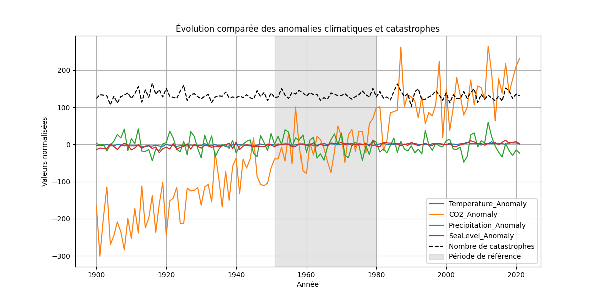
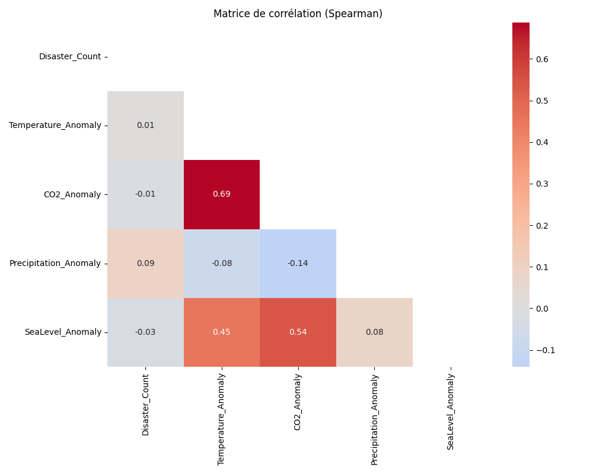
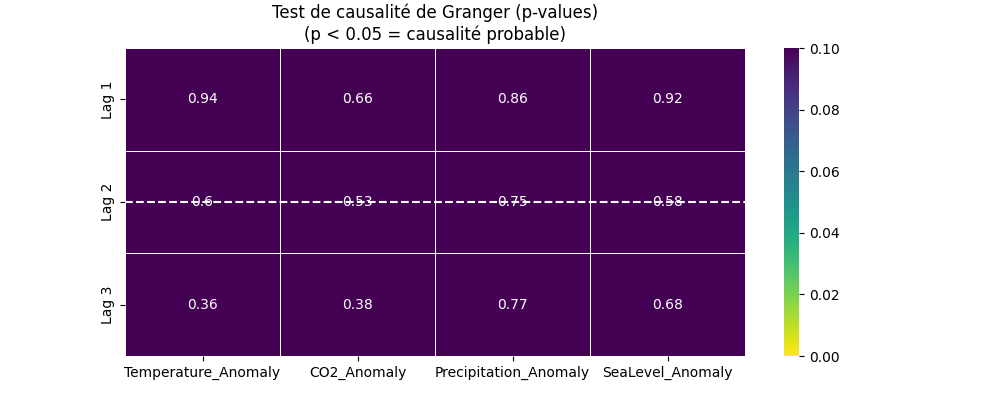

# Climate & Disasters Data Analysis

Analyzing the Link Between Climate Change and Natural Disasters

[](https://www.python.org/)
[](https://jupyter.org/)
[](https://pandas.pydata.org/)
[](LICENSE)
[](https://CaptainA10.github.io/Climate-Disasters-Data-Analysis/outputs/maps/carte_catastrophes_pays.html)

**Live Interactive Map**: [https://CaptainA10.github.io/Climate-Disasters-Data-Analysis/outputs/maps/carte_catastrophes_pays.html](https://CaptainA10.github.io/Climate-Disasters-Data-Analysis/outputs/maps/carte_catastrophes_pays.html)

## Project Overview

This project explores the relationship between climate change indicators (Global Temperature, CO2 Emissions, Sea Level Rise) and the frequency and intensity of natural disasters (Droughts, Earthquakes, Floods, etc.) over the last century (1900-2021).

Using data from the EM-DAT International Disaster Database and global climate records, we apply statistical analysis and visualization techniques to identify trends and correlations.

## Features

- Data Integration: Merging disparate datasets (Disasters, Climate, Weather Stations)
- Exploratory Data Analysis (EDA): Temporal trends of disasters and climate metrics
- Statistical Modeling: Correlation matrices (Pearson/Spearman) and Granger Causality Tests to investigate temporal relationships
- Geospatial Analysis: Mapping disaster locations and weather stations
- Interactive Visualizations: Dynamic plots using Plotly and static charts with Seaborn/Matplotlib

## Architecture & Workflow

The project follows a linear data science workflow implemented in Jupyter Notebooks.

| Stage | Description | Tools |
|-------|-------------|-------|
| 1. Data Acquisition | Loading raw data from EM-DAT (CSV/Excel) and Climate sources | `pandas` |
| 2. Preprocessing | Cleaning, handling missing values, merging datasets by Year/Country | `pandas`, `numpy` |
| 3. Analysis | Statistical tests, regression, time-series analysis | `statsmodels`, `scikit-learn` |
| 4. Visualization | Generating trends, heatmaps, and geospatial maps | `matplotlib`, `seaborn`, `plotly`, `folium` |
| 5. Output | Exporting processed data and figure images | `outputs/figures/` |

## Key Analytical Results

The analysis produces several key insights and visualizations stored in the `outputs/figures` directory.

### 1. Climate vs. Disasters Trends

Visualizing the parallel rise in global temperatures and the frequency of reported natural disasters.



### 2. Correlation Analysis

Heatmaps showing strong positive correlations between CO2 levels, Global Temperature, and specific disaster types (e.g., Extreme Weather).



### 3. Causality & Scenarios

Investigation of causal links using Granger Causality tests.



## Tech Stack

### Core

- Python 3.10+
- Jupyter Notebook

### Data Manipulation

- pandas
- numpy
- dask (for larger datasets)

### Visualization

- matplotlib
- seaborn
- plotly

### Geospatial

- geopandas
- folium

### Statistics & ML

- statsmodels
- scikit-learn

## Installation & Usage

**Clone the repository**

```bash
git clone https://github.com/your-username/Climate_Challenges.git
cd Climate_Challenges
```

**Install Dependencies**

It is recommended to use a virtual environment.

```bash
pip install pandas numpy matplotlib seaborn plotly statsmodels scikit-learn geopandas folium dask openpyxl
```

**Run the Analysis**

Open the main notebook to reproduce the results:

```bash
jupyter notebook notebooks/TP_OD_3_Climatique.ipynb
```

## Project Structure

```
Climate_Challenges/
├── data/
│   ├── raw/            # Original datasets (EM-DAT, etc.)
│   └── processed/      # Cleaned and merged data
├── notebooks/
│   └── TP_OD_3_Climatique.ipynb  # Main analysis notebook
├── outputs/
│   ├── figures/        # Generated plots and charts
│   └── tables/         # Exported summary tables
└── README.md           # Project documentation
```

## Data Sources

- EM-DAT International Disaster Database
- Global Climate Records
- Weather Station Data

## Links

- Live Interactive Map: [https://CaptainA10.github.io/Climate-Disasters-Data-Analysis/outputs/maps/carte_catastrophes_pays.html](https://CaptainA10.github.io/Climate-Disasters-Data-Analysis/outputs/maps/carte_catastrophes_pays.html)
- Repository: [https://github.com/CaptainA10/Climate-Disasters-Data-Analysis](https://github.com/CaptainA10/Climate-Disasters-Data-Analysis)
- Python: [https://www.python.org/](https://www.python.org/)
- Jupyter: [https://jupyter.org/](https://jupyter.org/)
- Pandas: [https://pandas.pydata.org/](https://pandas.pydata.org/)
- EM-DAT Database: [https://www.emdat.be/](https://www.emdat.be/)

## Author

**NGUETTE FANE Gad**

Data Engineer Student – Cloud & Analytics

Email: nguettefanegad@gmail.com
